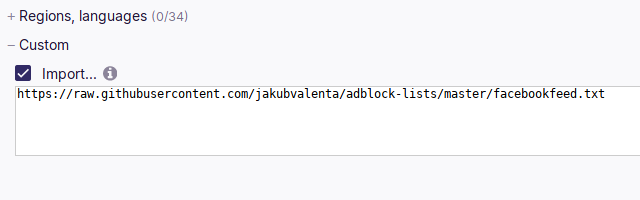
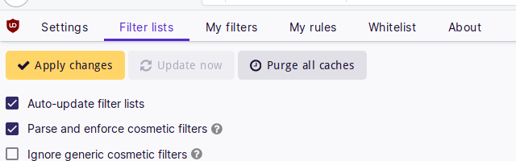

# Adblock Lists

Modify some websites using Adblock.

## Facebook

- Hide events and recommendations from the feed.
- Hide Stories.
- Hide Rooms.

https://raw.githubusercontent.com/jakubvalenta/adblock-lists/master/facebook.txt

## Instagram

- Hide Stories.
- Hide the number of likes.

https://raw.githubusercontent.com/jakubvalenta/adblock-lists/master/instagram.txt

## Substack

- Hide subscribe dialogs.

https://raw.githubusercontent.com/jakubvalenta/adblock-lists/master/substack.txt

## Twitter

- Hide the "You might like" section.
- Hide the "What's happening" section.
- Hide the "Who to follow" section.

https://raw.githubusercontent.com/jakubvalenta/adblock-lists/master/twitter.txt

## YouTube

- Hide all comments.
- Hide the number of subscribers.
- Hide video rating.
- Hide heat map ("Most replayed").
- Hide stream chat ("Live chat replay").
- Hide the "People also watched" section.
- Hide the "Learn while you're at home" section.
- Hide the "Developing news" box.

https://raw.githubusercontent.com/jakubvalenta/adblock-lists/master/youtube.txt

## Installation

1. Install [uBlock Origin](https://github.com/gorhill/uBlock).

2. Add URLs of the desired filter lists to _uBLock Origin Settings_ > _Filter
   Lists_ > _Custom_:

    https://raw.githubusercontent.com/jakubvalenta/adblock-lists/master/facebook.txt

    https://raw.githubusercontent.com/jakubvalenta/adblock-lists/master/instagram.txt

    https://raw.githubusercontent.com/jakubvalenta/adblock-lists/master/substack.txt

    https://raw.githubusercontent.com/jakubvalenta/adblock-lists/master/twitter.txt

    https://raw.githubusercontent.com/jakubvalenta/adblock-lists/master/youtube.txt

    

3. Click _Apply changes_:

    

## Contributing

__Feel free to remix this project__ under the terms of the [Apache License,
Version 2.0](http://www.apache.org/licenses/LICENSE-2.0).
