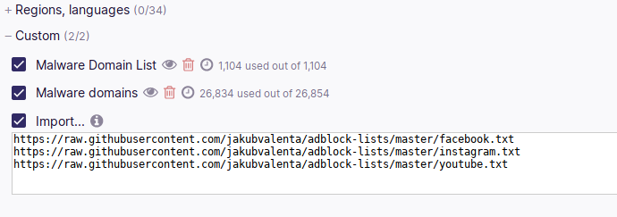

# Adblock Lists

Modify some websites using Adblock.

## Facebook Feed

Remove events and recommendations from the Facebook feed.

https://raw.githubusercontent.com/jakubvalenta/adblock-lists/master/facebookfeed.txt

## Instagram and Facebook

Remove Stories from the Instagram and Facebook websites.

https://raw.githubusercontent.com/jakubvalenta/adblock-lists/master/stories.txt

## YouTube

Remove all comments.

https://raw.githubusercontent.com/jakubvalenta/adblock-lists/master/youtube.txt

## Installation

1. Install [uBlock Origin](https://github.com/gorhill/uBlock).

2. Add URLs of the desired filter lists to _uBLock Origin Settings_ > _Filter
   Lists_ > _Custom_:

    https://raw.githubusercontent.com/jakubvalenta/adblock-lists/master/facebookfeed.txt

    https://raw.githubusercontent.com/jakubvalenta/adblock-lists/master/stories.txt

    https://raw.githubusercontent.com/jakubvalenta/adblock-lists/master/youtube.txt

    

3. Click _Apply changes_:

    

## Contributing

__Feel free to remix this project__ under the terms of the [Apache License,
Version 2.0](http://www.apache.org/licenses/LICENSE-2.0).
